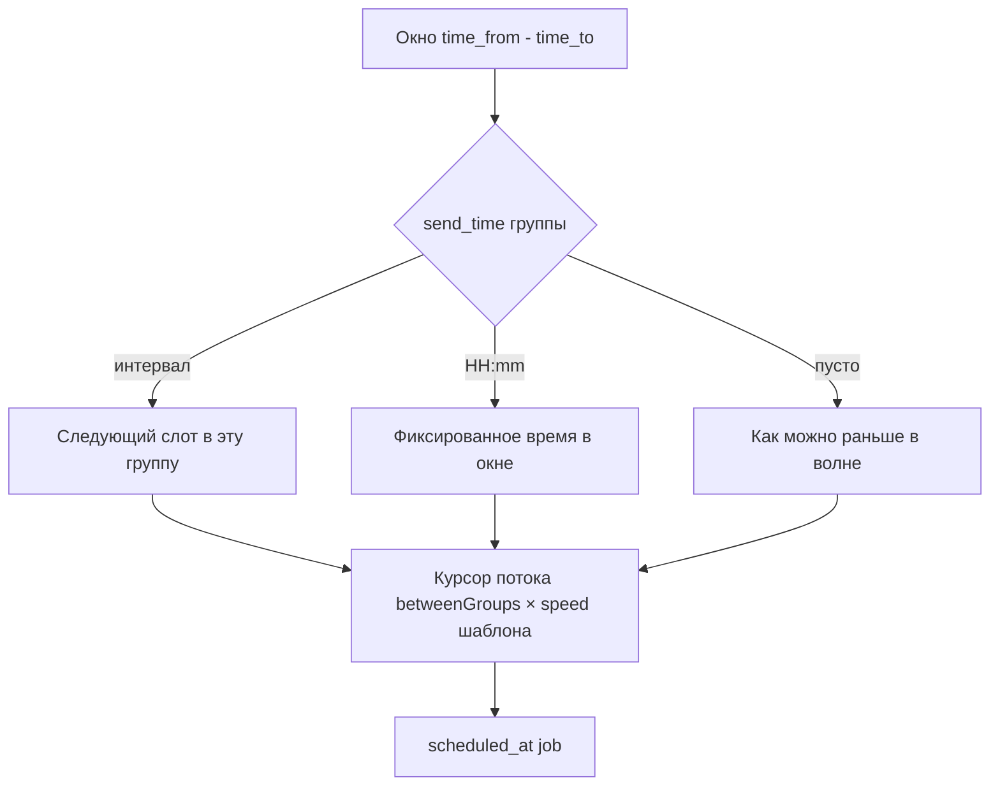

# Время и интервалы в рассылках: карта системы и идея «единой точки»

## Зачем настройки разъехались

В коде заложены **три уровня**, которые нельзя честно свести в одно поле без потери гибкости:

| Уровень | Смысл | Почему не в одном экране |
|--------|--------|---------------------------|
| **Волна (кампания)** | Общий ритм запуска: окно суток, пауза между *разными* группами, между шаблонами, повтор волны | Одно на все шаблоны и группы; хранится в `campaigns.*` |
| **Шаблон** | Текст + «скорость» (множитель к паузе между группами) + время по умолчанию TG/WA | Зависит от контента; в `message_templates.*` |
| **Группа** | `send_time`: «как часто / во сколько в *эту* группу» | Одна запись на чат в `whatsapp_groups` / `telegram_groups`; общая для всех шаблонов |

Итог: это **не дубли**, а разные оси (поток волны vs расписание чата vs настройка сообщения).

Подробный разбор очереди `scheduled_at`: [INTERVALS-LOGIC-REPORT.md](./INTERVALS-LOGIC-REPORT.md).

---

## Где в приложении что меняется (актуальная карта)

| Что | Где в UI | Куда пишется / что делает |
|-----|----------|---------------------------|
| Окно отправки (часы суток) | Рассылки → **Действия** → Время | `timeFrom`/`timeTo` → `campaigns.time_from` / `time_to`, `clampToWindow` |
| Пауза между группами TG/WA | Рассылки → **Планирование** → Паузы | `between_groups_sec_min/max` |
| Пауза между шаблонами | Там же | `between_templates_min_min/max` |
| Повтор волны | Там же | `repeat_*`, `next_repeat_at` |
| Скорость TG/WA для шаблона | Редактор шаблона | `tg_speed_factor` / `wa_speed_factor` → масштаб к `betweenGroups` при планировании job |
| Время по умолчанию для канала | Редактор шаблона | `tg_default_send_time` / `wa_default_send_time` → fallback для `send_time` |
| Интервал/время по группе | **Группы WA**, **Группы TG**, колонка интервала; **в шаблоне** — на строке группы (то же поле) | `send_time` (`HH:mm` или ключ `2-5m`, `4h`, … см. `GROUP_INTERVALS` в `campaigns.service.ts`) |
| Переопределение для пары шаблон–группа | Редактор шаблона (targets) | `template_group_targets.send_time_override` (если используется в вашей ветке) |

Приоритет **effective send_time** при планировании (упрощённо):  
`override` из шаблона → иначе дефолт шаблона → иначе `send_time` группы.

---

## Как считается время одной отправки (цепочка)

Между шаблонами к `cursor` добавляются минуты `betweenTemplates`.  
Повтор волны — отдельный таймер (`CampaignRepeatService`), не путать с паузой между группами.

---

## Предложение: «единая точка» без поломки модели данных

**Цель:** один экран в голове пользователя, а не одна таблица в БД (данные по смыслу разные).

### Фаза A (быстро, уже делается в UI)

- **Центр времени** — Drawer/страница со:
  - краткой схемой (как выше);
  - таблицей «где крутить»;
  - кнопками: Рассылки (планирование), Шаблоны, Группы WA, Группы TG.
- В **Планировании** на рассылках — кнопка «Как устроены интервалы?».

### Панель «Планирование — сводка» (Drawer)

- Открывается из шапки; **внутри одной панели** — переключатель **«Прогноз» | «Окно и паузы» | «Справка»** (sticky), чтобы не казалось набором разных окон. Активный пункт синхронизируется с **ручной прокруткой** через `IntersectionObserver` (полоса по центру `.ant-drawer-body`, `rootMargin` ≈ −36%); при клике по сегменту и при `openDrawer(...)` обновление из observer на ~650–950 мс подавляется, чтобы не драться с `scrollIntoView`. `openDrawer('settings' | 'scheme' | 'calc')` прокручивает к якорям: верх сводки, `#timing-hub-help-anchor` (свернутый блок «Диагностика» + «Где что менять»), `#timing-hub-advanced-inline`. Раскрывается `Collapse` для «Диагностика» при вкладке `scheme` или при выборе «Справка». У расширенных настроек **«Скрыть» / «Показать»** (`timing_hub_advanced_collapsed_v1`); при `openDrawer('calc')`, ссылке из календаря и шаге тура блок раскрывается.
- Контент обёрнут в **`ConfigProvider` + единый `getPopupContainer`** на `.ant-drawer-body`, чтобы **DatePicker, TimePicker, Dropdown** и прочие попапы не обрезались `overflow` у тела drawer (без дублирования на каждом компоненте).
- **Тур:** 4 шага (план → итог → **расширенные настройки** → ссылки); подсветка с прокруткой к центру. **Авто-показ** только при открытии со «сводкой» (`openDrawer()` / `settings`), не при `scheme` / `calc`, чтобы не конфликтовать с программным скроллом. Флаг в `localStorage`: `timing_hub_intro_tour_v1`. Повтор — **«Обзор»**; сброс авто-тура — стрелка у «Обзор» → «Сбросить авто-тур», либо в консоли: `window.dispatchEvent(new Event('timingHub:resetTour'))` или `localStorage.removeItem('timing_hub_intro_tour_v1')`. На шаге «Навигация» панель **«Диагностика»** раскрывается автоматически. В футере тура — **«Пропустить тур»** (закрывает без прохождения шагов). Из **личного кабинета** — блок «Тур по планированию» → переход на `/dashboard/campaigns`, в `sessionStorage` ставится `timingHub_postNavigate=planningTour`; на дашборде открывается drawer «сводка» и после загрузки — тур (отложенный запуск через `timingHub_deferredTour`).
- Загрузка контента панели: **Skeleton** в виде нескольких «карточек» (ближе к реальной вёрстке), с `role="status"` / `aria-busy`.
- Подсказки **Tooltip** у сегментов **«Цель»**, **«Период календаря»**, **«Канал»**.
- **a11y drawer:** `keyboard`, `aria-labelledby` на заголовок; у кнопок дней календаря (сетка и список) — `aria-label` / `aria-pressed` где уместно.

### Фаза B (средний срок) — **сделано**

- Страница **`/dashboard/campaigns/timing`**: read-only сводка
  - настройки волны из **localStorage** (как на «Планирование» в Рассылках);
  - выбранные группы **WA / TG** с колонкой **интервал / время** (`send_time`), данные с API (пагинация по 200);
  - таблица **шаблонов** со скоростями и временем по умолчанию.
- С страницы **Рассылки** — «Открыть планирование», «Справка: где что менять», ссылка на табличную сводку; со страницы **`/dashboard/campaigns/timing`** — кнопка открытия той же панели.

### Фаза C (если нужна настоящая «одна форма»)

Краткое описание серверного профиля тайминга, зачем он и почему отдельный этап — в **[TIMING-PROFILE-PHASE-C.md](./TIMING-PROFILE-PHASE-C.md)** (удобно держать открытым рядом с задачами).

### Синхронизация констант

- Держать в одном месте список ключей интервалов (`GROUP_INTERVALS` / `SEND_INTERVAL_OPTIONS`) — см. [PRODUCTION-READINESS-INTERVALS-UX.md](./PRODUCTION-READINESS-INTERVALS-UX.md).

### Режим канала в прогнозе = «Запуск» на «Рассылках»: ключ `campaigns_timing_start_mode_v1`

Выбор **«Канал»** в панели **«Планирование — сводка»** (блок «План и календарь») должен совпадать с сегментом **«Запуск»** на странице **`/dashboard/campaigns`**: оба влияют на то, какие группы и объём попадают в прогноз (TG + WA / только TG / только WA).

| Что | Детали |
|-----|--------|
| **Ключ localStorage** | `campaigns_timing_start_mode_v1` |
| **Значения** | `both` \| `tg` \| `wa` (тип `StartMode` в `frontend/src/lib/campaignCapacity`) |
| **Обёртки** | `readTimingStartMode()` / `writeTimingStartMode()` в `frontend/src/components/timingHubSession.ts` (константа `LS_KEY_TIMING_START_MODE`) |

**Сценарий синхронизации между панелью и «Рассылками»:**

1. При загрузке страницы «Рассылки» и при открытии drawer панели планирования состояние читается из `localStorage` через `readTimingStartMode()`.
2. При смене режима пользователем (в панели или на «Рассылках») вызывается `writeTimingStartMode(mode)` и диспатчится **`window.dispatchEvent(new Event('timingHub:changed'))`**, чтобы второй экран обновил UI без перезагрузки, если он уже открыт.
3. Для **другой вкладки** того же origin срабатывает стандартное событие **`storage`** (на `campaigns_timing_start_mode_v1` в другой вкладке) — оба места подписаны и подтягивают актуальное значение.

Итог: один ключ, одна логика; расхождение «прогноз на TG+WA, а запуск только WA» из‑за разных локальных состояний больше не должно возникать при работе в одном браузере. На другом устройстве или профиле браузера значение по-прежнему локальное — это ограничение клиентского хранилища, не баг синка между экранами.

См. также карту панели и ключей: [TIMING-HUB-PANEL-MAP.md](./TIMING-HUB-PANEL-MAP.md).

---

## Резюме для разработчика

Сложность ощущается из‑за **трёх ролей настроек** (волна / шаблон / чат). Единая точка для пользователя = **навигатор + объяснение + ссылки**; единая точка в данных возможна только как **профиль поверх** существующих таблиц, иначе теряется смысл `send_time` на группу.
